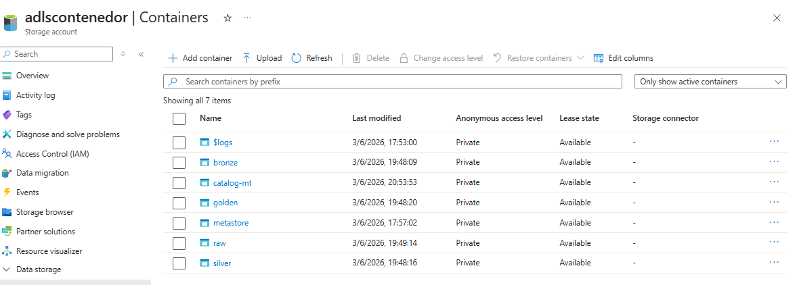
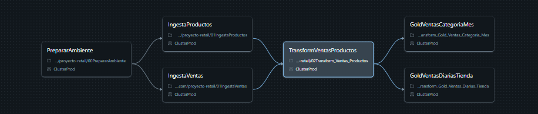
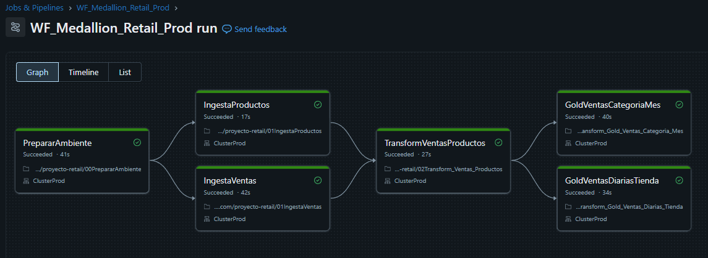
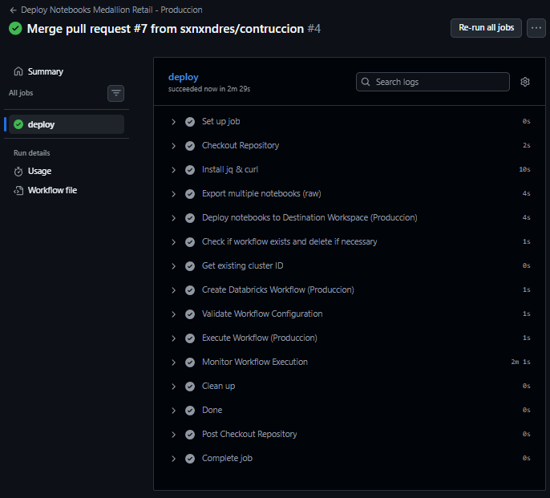

# Resumen del Proyecto - Pipeline de Ventas Retail con Arquitectura Medallion

Este proyecto consiste en un pipeline completo de ingeniería de datos construido sobre Azure Databricks, que procesa información de ventas y productos de una cadena retail siguiendo una arquitectura **Medallion (Bronze → Silver → Golden)**.

El objetivo es tomar los datos crudos de pedidos y artículos, limpiarlos, unirlos y transformarlos hasta llegar a tablas analíticas listas para el reporting (descuentos aplicados, ingresos por tienda y por categoría, etc.).



---

## Características principales

- Arquitectura Medallion completa (Bronze → Silver → Golden) sobre Unity Catalog
- Ingesta parametrizada con `dbutils.widgets` (catálogo, esquemas, nombre del storage) — sin valores fijos en el código
- Gobernanza de datos mediante External Locations y Storage Credentials de Unity Catalog
- Reglas de negocio aplicadas con Spark `when` (etiquetado de descuentos) en lugar de UDFs, por rendimiento
- Agregaciones Golden listas para análisis: ventas diarias por tienda y ventas mensuales por categoría
- Pipeline orquestado como job de Databricks Workflows (`WF_Medallion_Retail_Prod`) con dependencias entre tareas
- CI/CD con GitHub Actions que exporta, despliega y ejecuta automáticamente el pipeline en producción
- Notebook de reversión (`reversion/reverso.ipynb`) para limpiar tablas y datos del esquema completo
- Visualización de resultados en Power BI sobre las tablas Golden

---

## ¿De qué trata el proyecto?

El proyecto parte de dos archivos CSV crudos — `items.csv` (catálogo de productos) y `orders.csv` (pedidos de venta) — y construye un pipeline que los limpia, filtra, une y agrega hasta obtener métricas de negocio: ingresos brutos y netos, unidades vendidas, porcentaje de líneas con descuento, ticket promedio, etc., agrupadas por tienda/día y por categoría/mes.

Para esto fue necesario configurar un Data Lake en Azure (ADLS Gen2) con un contenedor por capa, gobernar el acceso mediante Unity Catalog (External Locations y Storage Credentials), parametrizar todos los notebooks con widgets (catálogo, esquemas, nombre del storage), y automatizar el despliegue a producción mediante GitHub Actions.

---

## Stack tecnológico

- **Azure Databricks** — entorno de ejecución de los notebooks y jobs
- **PySpark** — procesamiento y transformación de datos
- **Delta Lake** — formato de almacenamiento de las tablas
- **Unity Catalog** — gobernanza, catálogo (`catalog_dev`) y control de acceso (External Locations, Storage Credentials, Grants)
- **Azure Data Lake Storage Gen2** — almacenamiento de archivos por capa (raw, bronze, silver, golden)
- **GitHub Actions** — CI/CD para el despliegue automático de notebooks y jobs a producción
- **Power BI** — visualización y dashboards sobre las tablas Golden

---

## Arquitectura (Medallion)



Los datos se separan en contenedores distintos por capa dentro de ADLS Gen2 (`raw`, `bronze`, `silver`, `golden`), cada uno gobernado mediante una **External Location** (`extl-raw`, `extl-bronze`, `extl-silver`, `extl-golden`, `extl-catalog`) respaldada por una **Storage Credential** llamada `credential`. Sobre esa base se organiza el catálogo `catalog_dev` con un esquema por capa:

| Esquema  | Contenedor ADLS | Contenido |
|----------|-----------------|-----------|
| `raw`    | `raw`           | Archivos CSV de origen (`orders.csv`, `items.csv`) |
| `bronze` | `bronze`        | Tablas Delta con los datos crudos ingeridos + columna `INGESTION_DATE` |
| `silver` | `silver`        | Tabla limpia y unida `ventas_productos_categorias` |
| `golden` | `golden`        | Tablas agregadas `ventas_diarias_tienda` y `ventas_categoria_mes` |

---

## Estructura del repositorio

```
Proyecto_medallion_retail/
├── proceso/                                    # Notebooks del pipeline (orden de ejecución)
│   ├── 00PrepararAmbiente.ipynb                # Setup: external locations, catálogo, esquemas y tablas vacías
│   ├── 01IngestaProductos.ipynb                # raw -> bronze.productos
│   ├── 01IngestaVentas.ipynb                   # raw -> bronze.ventas
│   ├── 02Transform_Ventas_Productos.ipynb      # bronze -> silver (join + etiqueta de descuento)
│   ├── 03Transform_Gold_Ventas_Diarias_Tienda.ipynb   # silver -> golden (agregación diaria por tienda)
│   └── 03Transform_Gold_Ventas_Categoria_Mes.ipynb    # silver -> golden (agregación mensual por categoría)
├── seguridad/
│   └── 4.Grants.ipynb                          # Permisos (GRANT/REVOKE) sobre catálogo, esquemas y external locations
├── reversion/
│   └── reverso.ipynb                           # Notebook para eliminar tablas y datos del esquema
├── datasets/                                   # CSVs de origen (items.csv, orders.csv)
├── dashboard/
│   └── Dashboard.pbix                          # Dashboard de Power BI sobre las tablas Golden
├── evidencias/                                 # Capturas de los recursos, workflows y dashboards
└── .github/workflows/
    └── deploy-produccion.yml                   # CI/CD: despliegue y ejecución del pipeline en producción
```

---

## Dataset utilizado

Los datos provienen de dos archivos planos cargados al contenedor `raw`:

| Archivo | Descripción | Filas aprox. |
|---------|-------------|--------------|
| `items.csv` | Catálogo de productos — ID, nombre y categoría | 39.194 |
| `orders.csv` | Pedidos de venta — tienda, fecha, artículo, cantidad, precio, descuento, vendedor y estado | 1.090.380 |

### 1. Recursos de Azure utilizados
- Storage Account con Hierarchical Namespace habilitado (ADLS Gen2)
- Contenedores: `raw`, `bronze`, `silver`, `golden`
- Azure Databricks Workspace con Unity Catalog habilitado
- External Locations (`extl-raw`, `extl-bronze`, `extl-silver`, `extl-golden`, `extl-catalog`) y Storage Credential `credential`
- Clusters `ClusterDev` (desarrollo) y `ClusterProd` (producción)

### 2. Configuración del ambiente y Unity Catalog
El notebook `proceso/00PrepararAmbiente.ipynb` se ejecuta una sola vez para crear las External Locations, el catálogo `catalog_dev`, los esquemas (`raw`, `bronze`, `silver`, `golden`) y las tablas Delta vacías. El notebook `seguridad/4.Grants.ipynb` documenta los permisos (GRANT/REVOKE) sobre catálogo, esquemas, tablas y External Locations.

### 3. Ingesta de los datasets
Los notebooks `proceso/01IngestaProductos.ipynb` y `proceso/01IngestaVentas.ipynb` leen `items.csv` y `orders.csv` desde el contenedor `raw` y los escriben como tablas Delta en `bronze.productos` y `bronze.ventas`, agregando la columna `INGESTION_DATE`.

### 4. Pipeline de transformación
A partir de las tablas Bronze, el pipeline construye la capa Silver y luego las tablas Golden mediante los notebooks de la carpeta `proceso/`.

### 5. Job configurado
En Databricks Workflows se configuró el job `WF_Medallion_Retail_Prod`, que encadena los 6 notebooks en orden (preparación → ingestas → transformación Silver → agregaciones Golden) respetando sus dependencias.



---

## Transformaciones aplicadas

En la capa Silver (`02Transform_Ventas_Productos.ipynb`) se filtran los pedidos con `STATUS = 'VALID'`, se unen `ventas` y `productos` por `ID_ITEM` (usando `F.broadcast()` sobre la tabla de productos por ser la más pequeña) y se renombran las columnas a español (`ID_ARTICULO`, `PRODUCTO`, `CATEGORIA`, `ID_PEDIDO`, `TIENDA`, `FECHA`, `CANTIDAD`, `PRECIO`, `DESCUENTO`, `ID_VENDEDOR`, etc.).

### Campo calculado: etiqueta de descuento

Sobre la columna `DESCUENTO` se aplica una cadena de `when` de Spark (en lugar de UDF, por rendimiento) que clasifica cada línea de venta según el porcentaje de descuento aplicado:

| `DESCUENTO` | `ETIQUETA_DESCUENTO` |
|-------------|----------------------|
| 0           | `Precio Normal`      |
| 1–74        | `promoción`          |
| 75–99       | `bono empresarial`   |
| 100         | `Regalo`             |

El resultado se escribe en la tabla `silver.ventas_productos_categorias`.

---

## Tablas Golden

### `ventas_diarias_tienda`
Agregación diaria por tienda (`03Transform_Gold_Ventas_Diarias_Tienda.ipynb`):

| Columna | Descripción |
|---------|-------------|
| `TIENDA`, `FECHA` | Llaves de agrupación |
| `NUM_PEDIDOS` | Pedidos distintos del día |
| `TOTAL_UNIDADES` | Unidades vendidas |
| `INGRESO_BRUTO` / `INGRESO_NETO` | Ingreso antes y después de aplicar el descuento |
| `DESCUENTO_MEDIO_PCT` | Descuento promedio (sólo líneas con descuento) |
| `NUM_LINEAS_CON_DESCUENTO` / `NUM_LINEAS_TOTAL` | Conteo de líneas con y sin descuento |
| `PCT_LINEAS_CON_DESCUENTO` | Porcentaje de líneas con descuento |
| `FECHA_ACTUALIZACION` | Marca de tiempo de la carga |

### `ventas_categoria_mes`
Agregación mensual por categoría de producto (`03Transform_Gold_Ventas_Categoria_Mes.ipynb`):

| Columna | Descripción |
|---------|-------------|
| `CATEGORIA`, `ANIO`, `MES` | Llaves de agrupación |
| `NUM_PEDIDOS` / `NUM_ARTICULOS` / `TOTAL_UNIDADES` | Métricas de volumen |
| `INGRESO_BRUTO` / `INGRESO_NETO` / `PRECIO_PROMEDIO` | Métricas de ingresos |
| `NUM_LINEAS_CON_DESCUENTO` / `PCT_LINEAS_CON_DESCUENTO` / `DESCUENTO_MEDIO_PCT` | Métricas de descuento |
| `NUM_PRECIO_NORMAL` / `NUM_PROMOCION` / ... | Conteo de líneas por etiqueta de descuento |

Ambas tablas se escriben con `coalesce(4)` y `mode("overwrite")` mediante `insertInto`.

---

## CI/CD implementado

Se configuró un workflow de GitHub Actions (`.github/workflows/deploy-produccion.yml`) que se dispara con cada `push` a `main`: exporta los 6 notebooks desde el workspace de construcción (DEV), los importa al workspace de producción (PROD), valida/crea el cluster `ClusterProd`, configura el job `WF_Medallion_Retail_Prod` con sus dependencias y parámetros, lo ejecuta y monitorea su finalización.

Los secrets configurados en el repositorio son:
- `DATABRICKS_ORIGIN_HOST` / `DATABRICKS_ORIGIN_TOKEN` — host y token del workspace de construcción (DEV)
- `DATABRICKS_DEST_HOST` / `DATABRICKS_DEST_TOKEN` — host y token del workspace de producción (PROD)



---

## Dashboard

Sobre las tablas Golden se construyó un dashboard en Power BI (`dashboard/Dashboard.pbix`) con la carga de datos desde Databricks y dos vistas principales: ventas por mes y ventas por categoría y mes.


---

## Autor

Proyecto desarrollado por **André Muñoz** como entregable del curso de Ingeniería de Datos con Azure Databricks de SmartData.
